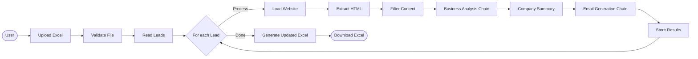

# AI-Powered Personalized Cold Email Generator

An intelligent application that automatically researches companies from an uploaded Excel spreadsheet and generates highly personalized cold emails using Google's Gemini AI and LangChain.

## Project Structure Setup

This is the initial setup of the project structure. More documentation to follow as features are implemented!

## Core Workflow

